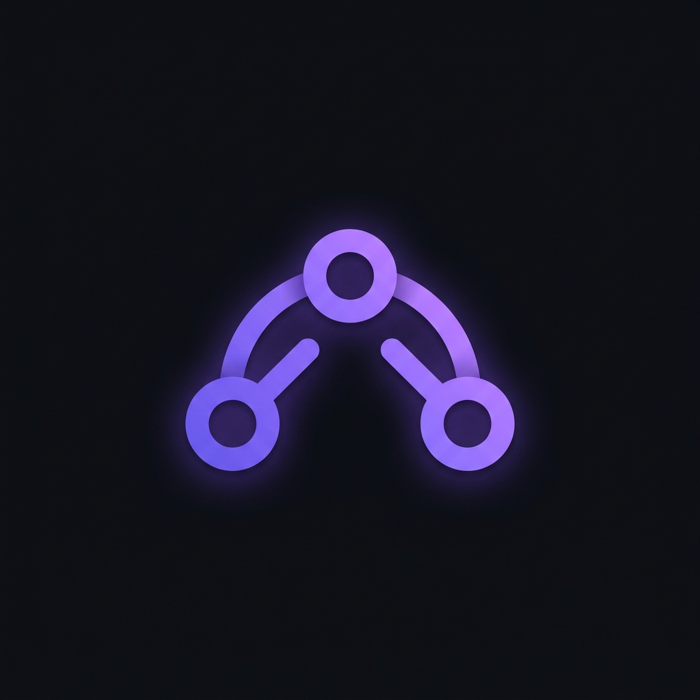

# UniMemo — AI Context Bridge 🔗

> Switch between Claude, ChatGPT, and Gemini without losing your conversation context.



---

## The Problem

Every time you switch AI platforms mid-conversation, you re-explain everything from scratch. That's friction. UniMemo eliminates it.

## What It Does

1. **Capture** — One click saves your entire conversation from Claude, ChatGPT, or Gemini
2. **Copy** — Formats it into a structured context prompt
3. **Paste** — Drop it into any other AI and continue exactly where you left off

---

## Features

- ⚡ **One-click capture** from Claude.ai, ChatGPT, and Gemini
- 🗜 **TSGC Compression** — custom algorithm that stores up to 50 messages at 80% less storage
- 🎯 **2-step workflow UI** — clear Step 1 → Step 2 flow, no confusion
- 🔒 **100% local** — nothing leaves your browser, no servers, no accounts
- 🆓 **Free forever** — no Chrome Web Store needed, load unpacked in dev mode

---

## Tech Stack

- Manifest V3 Chrome Extension
- Vanilla JS (zero dependencies)
- Native `CompressionStream` API (DEFLATE)
- `chrome.storage.local` for persistence
- Custom DOM scrapers per platform

---

## TSGC Compression

*Temporal Semantic Gradient Compression* — a 3-layer pipeline designed specifically for AI conversation context:

| Layer | Technique | Savings |
|---|---|---|
| 1 | Cross-turn sentence deduplication | ~15% |
| 2 | Temporal gradient pruning (Zone 1: verbatim, Zone 2: 40%, Zone 3: 15%) | ~55% |
| 3 | Native DEFLATE byte compression | ~35% on result |

**Overall: ~80% storage reduction vs raw text.**

Recent messages are kept verbatim (Zone 1). Older messages are progressively compressed — inspired by how human working memory encodes recency with higher fidelity.

---

## Installation (Free — No Store Needed)

```bash
# 1. Clone the repo
git clone https://github.com/Utkarsh-Aggarwal/UniMemo.git

# 2. Open Chrome and go to:
chrome://extensions

# 3. Enable Developer Mode (top right toggle)

# 4. Click "Load unpacked" → select the UniMemo folder

# 5. The 🔗 icon appears in your toolbar
```

---

## How to Use

1. Open any conversation on **Claude.ai**, **ChatGPT**, or **Gemini**
2. Click the UniMemo icon → **⚡ Capture This Conversation**
3. Switch to a different AI platform
4. Click **📋 Copy & Switch AI**
5. Paste (`Cmd+V` / `Ctrl+V`) into the new chat
6. Continue your conversation seamlessly

---

## Folder Structure

```
UniMemo/
├── manifest.json
├── icons/
│   ├── icon-16.png
│   ├── icon-48.png
│   └── icon-128.png
├── background/
│   └── service-worker.js      # Storage, compression, message routing
├── content/
│   ├── claude-scraper.js      # Claude.ai DOM scraper
│   ├── chatgpt-scraper.js     # ChatGPT DOM scraper
│   └── gemini-scraper.js      # Gemini DOM scraper
├── popup/
│   ├── popup.html
│   ├── popup.css              # Dark UI with glassmorphism
│   └── popup.js
└── utils/
    └── context-formatter.js   # Prompt formatting utilities
```

---

## Roadmap

- [ ] Auto-inject context into textarea (no manual paste)
- [ ] Conversation history (last 5 captures)
- [ ] Perplexity + Mistral support
- [ ] Side panel mode
- [ ] On-device summarisation using Chrome Prompt API
- [ ] Chrome Web Store publish

---

## Known Limitations

- DOM scrapers may break when Claude/ChatGPT/Gemini update their UI — if capture fails, open an issue with the browser console output
- Gemini scraper is less reliable than Claude/ChatGPT (Angular SPA is harder to scrape)

---

## Contributing

Issues and PRs welcome. If a scraper breaks on your version of a platform, open an issue with:
1. The platform name
2. Output of `document.querySelectorAll('[data-message-author-role]').length` in the browser console

---

## License

MIT — use it, fork it, improve it.

---

*Built by [Utkarsh Aggarwal](https://github.com/Utkarsh-Aggarwal) · Week 1 of building in public*
